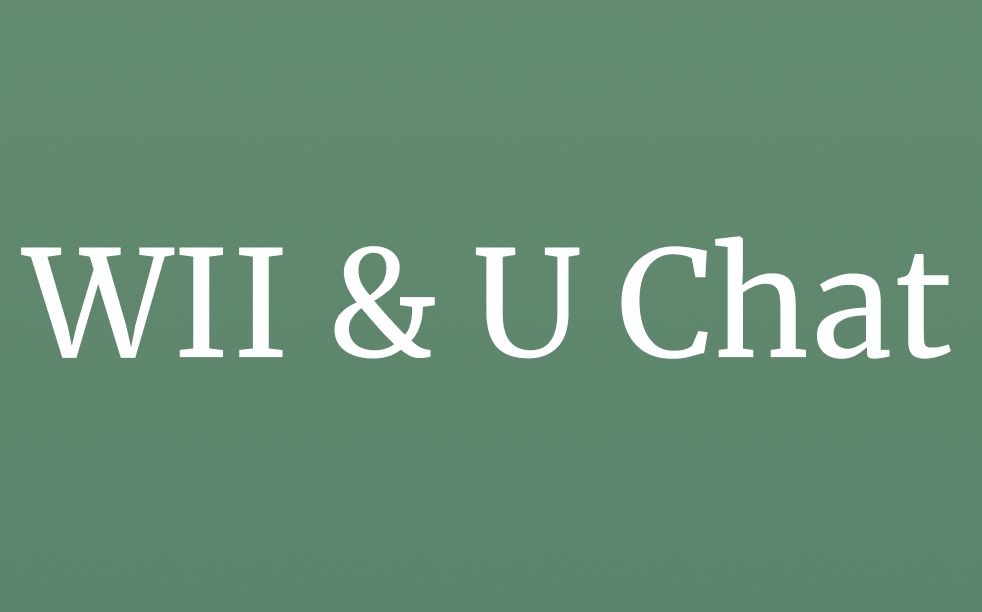

[![Contributors][contributors-shield]][contributors-url]
[![Forks][forks-shield]][forks-url]
[![Stargazers][stars-shield]][stars-url]
[![Issues][issues-shield]][issues-url]
[![project_license][license-shield]][license-url]
[![LinkedIn][linkedin-shield]][linkedin-url]

 

  

  <h3 align="center">Wii & U Chat</h3>

  

    Eine einfache, intuitive Chat-App für gemeinschaftliche Kommunikation in Echtzeit.
     
    <a href="https://github.com/petabytebrain/Wii-n-U-Chat"><strong>Explore the docs »</strong></a>
     
     
    <a href="https://github.com/petabytebrain/Wii-n-U-Chat">View Demo</a>
    &middot;
    <a href="https://github.com/petabytebrain/Wii-n-U-Chat/issues/new?labels=bug&template=bug-report---.md">Report Bug</a>
    &middot;
    <a href="https://github.com/petabytebrain/Wii-n-U-Chat/issues/new?labels=enhancement&template=feature-request---.md">Request Feature</a>
  

  
Table of Contents

  <ol>
    <li><a href="#about-the-project">About The Project</a></li>
    <li><a href="#built-with">Built With</a></li>
    <li><a href="#usage">Usage</a></li>
    <li><a href="#roadmap">Roadmap</a></li>
    <li><a href="#contributing">Contributing</a></li>
    <li><a href="#license">License</a></li>
    <li><a href="#contact">Contact</a></li>
    <li><a href="#acknowledgments">Acknowledgments</a></li>
  </ol>

## About The Project

[![Product Name Screen Shot][product-screenshot]](https://example.com)

**Wii & U Chat** ist eine benutzerfreundliche Chat-Applikation, die Nutzer in einem gemeinsamen Chatraum verbindet. Ziel ist es, digitale Kommunikation so unkompliziert wie möglich zu gestalten – ohne überladene Funktionen, sondern mit Fokus auf eine zentrale, gemeinschaftliche Kommunikation.

Die App bietet:
- Einen gemeinsamen Echtzeit-Chatraum
- Benutzername-Eingabe zu Beginn
- Übersichtliche Bottom Navigation
- Seiten für Einstellungen, FAQs und den Chat selbst

**Seitenstruktur:**
- **Einstiegsseite:** Benutzername setzen
- **Chat-Seite:** Nachrichten senden & empfangen
- **FAQ-Seite:** Hilfe & Informationen
- **Settings-Seite:** Benutzereinstellungen verwalten

(<a href="#readme-top">back to top</a>)

### Built With

* [![React][React.js]][React-url]
* [![Next][Next.js]][Next-url]
* [![Bootstrap][Bootstrap.com]][Bootstrap-url]

(<a href="#readme-top">back to top</a>)

## Usage

Nach Eingabe eines Benutzernamens gelangen Nutzer direkt in den Chatraum, in dem alle bisherigen Nachrichten sichtbar sind. Die intuitive Navigation erlaubt schnellen Wechsel zu Einstellungen oder FAQ. Ideal für Gruppen, Communities oder einfache digitale Treffen.

(<a href="#readme-top">back to top</a>)

## Roadmap

- [ ] Dark Mode
- [ ] Nachrichten löschen
- [ ] Private Nachrichten
- [ ] Multilingual Support
- [ ] Emoji-Integration

(<a href="#readme-top">back to top</a>)

## Contributing

Contributions are what make the open source community such an amazing place to learn, inspire, and create. Any contributions you make are **greatly appreciated**.

1. Fork the Project  
2. Create your Feature Branch (`git checkout -b feature/AmazingFeature`)  
3. Commit your Changes (`git commit -m 'Add some AmazingFeature'`)  
4. Push to the Branch (`git push origin feature/AmazingFeature`)  
5. Open a Pull Request

(<a href="#readme-top">back to top</a>)

## License

Distributed under the MIT License. See `LICENSE.txt` for more information.

(<a href="#readme-top">back to top</a>)

## Contact

Dein Name – [@twitter_handle](https://twitter.com/twitter_handle) – email@email_client.com  
Projekt-URL: [https://github.com/petabytebrain/Wii-n-U-Chat](https://github.com/petabytebrain/Wii-n-U-Chat)

(<a href="#readme-top">back to top</a>)

## Acknowledgments

* OpenAI ChatGPT für redaktionelle Hilfe
* [othneildrew/Best-README-Template](https://github.com/othneildrew/Best-README-Template)
* Deine Community & Tester:innen

(<a href="#readme-top">back to top</a>)

<!-- MARKDOWN LINKS & IMAGES -->
[contributors-shield]: https://img.shields.io/github/contributors/petabytebrain/Wii-n-U-Chat.svg?style=for-the-badge
[contributors-url]: https://github.com/petabytebrain/Wii-n-U-Chat/graphs/contributors
[forks-shield]: https://img.shields.io/github/forks/petabytebrain/Wii-n-U-Chat.svg?style=for-the-badge
[forks-url]: https://github.com/petabytebrain/Wii-n-U-Chat/network/members
[stars-shield]: https://img.shields.io/github/stars/petabytebrain/Wii-n-U-Chat.svg?style=for-the-badge
[stars-url]: https://github.com/petabytebrain/Wii-n-U-Chat/stargazers
[issues-shield]: https://img.shields.io/github/issues/petabytebrain/Wii-n-U-Chat.svg?style=for-the-badge
[issues-url]: https://github.com/petabytebrain/Wii-n-U-Chat/issues
[license-shield]: https://img.shields.io/github/license/petabytebrain/Wii-n-U-Chat.svg?style=for-the-badge
[license-url]: https://github.com/petabytebrain/Wii-n-U-Chat/blob/master/LICENSE.txt
[linkedin-shield]: https://img.shields.io/badge/-LinkedIn-black.svg?style=for-the-badge&logo=linkedin&colorB=555
[linkedin-url]: https://linkedin.com/in/linkedin_username
[product-screenshot]: images/screenshot.png
[React.js]: https://img.shields.io/badge/React-20232A?style=for-the-badge&logo=react&logoColor=61DAFB
[React-url]: https://reactjs.org/
[Next.js]: https://img.shields.io/badge/next.js-000000?style=for-the-badge&logo=nextdotjs&logoColor=white
[Next-url]: https://nextjs.org/
[Bootstrap.com]: https://img.shields.io/badge/Bootstrap-563D7C?style=for-the-badge&logo=bootstrap&logoColor=white
[Bootstrap-url]: https://getbootstrap.com
